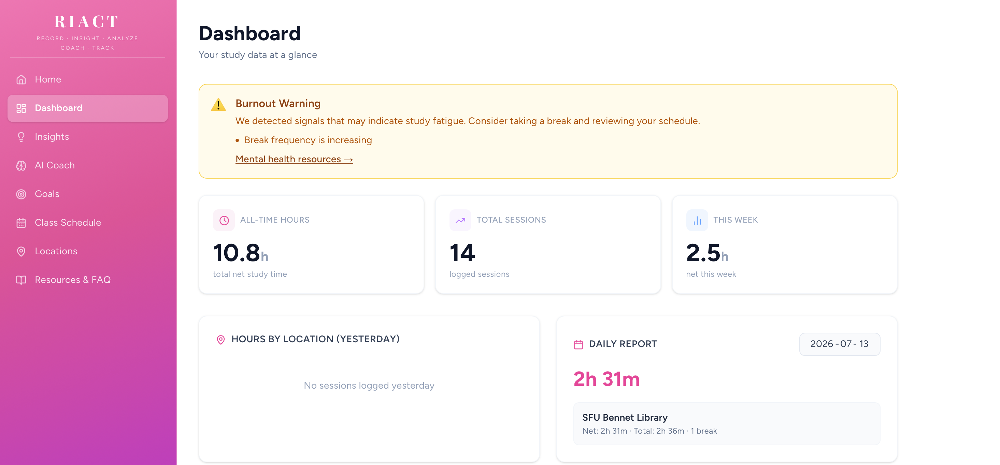
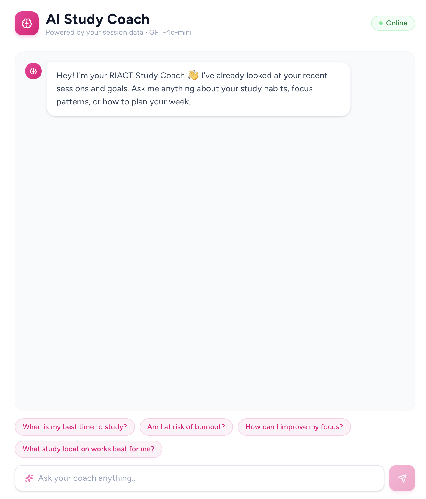
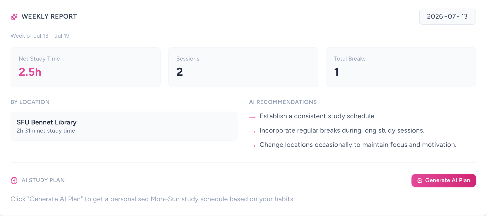
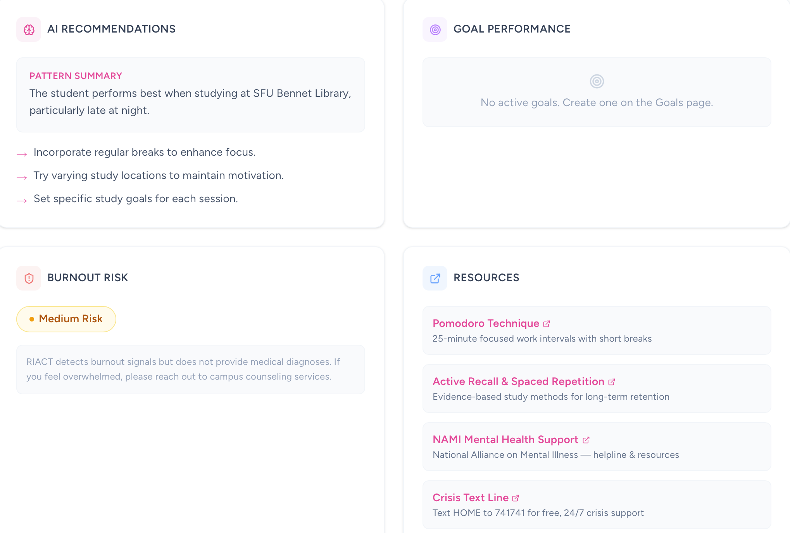

# RIACT — Record, Insight, Analyze, Coach, Track

[](https://doi.org/10.35542/osf.io/94hr5_v1) [](https://nextjs.org) [](https://www.typescriptlang.org) [](https://supabase.com) [](https://openai.com) [](https://riact-riasidhus-projects.vercel.app) [](LICENSE)

**RIACT is an AI-powered study habit tracker that helps students understand where and when they study best, detect burnout before it hits and get personalised coaching from an AI that knows their data.**

**Live demo:** https://riact-riasidhus-projects.vercel.app

---

## The Problem

Most students study hard. Very few know whether they're studying smart. Without data, it's impossible to tell whether the library at 9AM actually produces better focus than your bedroom at midnight, or whether the gradual shortening of your sessions and increase in breaks is a sign of burnout creeping in. These patterns exist — they're just invisible.

RIACT makes them visible. It tracks study sessions by location and time, calculates net study time by automatically accounting for breaks, and after just three sessions starts using AI to surface patterns, detect risk signals and give coaching that's grounded in the user's own data rather than generic advice.

---

## What It Does

**Session Tracking** is the foundation. Users start a session at any location — a library, a café, home — and RIACT runs a live timer. Breaks can be recorded mid-session, and when the session ends the user sees a full breakdown: start time, end time, every break, net study time versus total time at that location. Everything is editable before saving, and nothing gets locked in without the user's sign-off. If a session is ended too early by mistake, a Resume button on the review screen puts the timer straight back into active mode. Sessions can also be discarded entirely if they don't need to be logged. An active session banner persists across every page so you can always see your live timer and return to it no matter where you navigate.



---

**The Dashboard** brings everything together — all-time hours, weekly stats, a location breakdown pie chart, daily and weekly reports with date pickers, and a burnout warning banner when signals are detected in your data.



---

**AI Insights** unlock after three sessions. The Insights page sends your session history to GPT-4o-mini, which analyses patterns across location, time of day, break frequency, and session length to surface personalised recommendations. If the AI identifies that you consistently produce your best net study time on Tuesday mornings at the library, it says so specifically — not generically.

**Burnout Detection** runs continuously in the background. A deterministic, rule-based function monitors concrete signals — sessions getting shorter over time, breaks becoming more frequent, late-night cramming clustering, goal completion rates dropping — and surfaces a warning when enough signals are present. No model ever makes a claim about a user's mental state. The banner shows what the data looks like. The student decides what it means.



---

**The AI Weekly Plan** generates a personalised Monday-to-Sunday study schedule based on historical patterns. Rather than spreading hours evenly across the week, the model analyses which days and locations have historically produced the most focused work and builds a realistic plan around that. Each day includes a recommended location, a target number of hours, and a short focus tip. Rest days are included — recovery is part of studying smarter, not just working harder.

**Goals and Progress Tracking** lets users set daily or weekly study hour targets, optionally tied to a specific location. Progress bars update in real time as sessions are logged.



---

**The AI Study Coach** is a live chat interface where users can ask anything about their study habits. The model receives the last 30 days of sessions, active goals, and your full class schedule as context with every message, so its answers are grounded in real data rather than generic advice.

**Class Schedule Integration** allows users to enter their university timetable — course name, day, start and end time, and classroom location. Classes can be given active date ranges so a September semester schedule doesn't clutter the summer view. The timetable renders as a visual weekly grid with shaded blocks for class time, leaving white space that instantly shows available study windows. Users can skip a single week's occurrence without deleting the recurring entry. The full schedule is passed as context to both the AI Coach and the Weekly Plan generator, so the AI never suggests studying during class hours.

---

## Tech Stack

RIACT is built on **Next.js 16** with the App Router, TypeScript throughout and Tailwind CSS for styling. The database and authentication layer is **Supabase** — PostgreSQL under the hood, with row-level security on every table so users can only ever query their own data. The AI features run through the **OpenAI API** using GPT-4o-mini. Everything is deployed on **Vercel**.

Data visualisation uses Recharts. Icons are from Lucide React. Date handling uses date-fns.

---

## AI Architecture

When a user triggers an AI feature, a Next.js serverless API route fetches their last 30 days of sessions, active goals, and full class schedule from Supabase using a Bearer-token authenticated client — meaning RLS applies server-side and the route can only access data belonging to the authenticated user. That data is formatted as structured context and passed to GPT-4o-mini with a task-specific prompt.

For the Insights page, the model returns personalised recommendation bullet points. For the Weekly Plan, the endpoint uses `response_format: json_object` to return a structured day-by-day schedule. For the AI Coach, the model receives the full conversation history alongside the session context and responds conversationally.

JWT decoding happens locally on the server using a manual base64 decode — no extra network round-trip — to keep latency well under Vercel's 10-second serverless function timeout. Client-side AbortControllers cap all AI requests at 9 seconds and fail gracefully if the timeout is hit.

---

## Responsible AI Design

The most important design decision in RIACT was keeping burnout detection entirely separate from the AI. Burnout has real mental health implications, and a model labelling a student as burned out could be mistaken for a clinical assessment — which it is not qualified to make. The burnout detection system is a deterministic rule-based function: it checks concrete signals in the data, computes a risk level, and surfaces a warning. No model is involved at any point in that flow.

Every burnout warning is explicitly labelled as a signal detected in study data, not a diagnosis, and always surfaces a link to mental health resources rather than prescribing a course of action. The AI Coach is system-prompted to stay strictly within study habit advice and to redirect any mental health topics to professional support rather than engaging with them.

The AI recommends. The rules engine warns. The student decides.

---

## Running Locally

Clone the repo and install dependencies:

```bash
npm install
```

Create a `.env.local` file in the project root with the following:

```
NEXT_PUBLIC_SUPABASE_URL=your_supabase_url
NEXT_PUBLIC_SUPABASE_ANON_KEY=your_supabase_anon_key
OPENAI_API_KEY=your_openai_key
```

Then start the development server:

```bash
npm run dev
```

Open [http://localhost:3000](http://localhost:3000).

---

## Citation

RIACT is described in a peer-viewable preprint:

> Sidhu, R. (2026). *RIACT: A responsible AI system for personalized study habit tracking and early burnout signal detection in university students.* EdArXiv. https://doi.org/10.35542/osf.io/94hr5_v1

If you use or reference RIACT, please cite the preprint (see also `CITATION.cff`).

---

Built by **Ria Sidhu**.

*Record · Insight · Analyze · Coach · Track*
